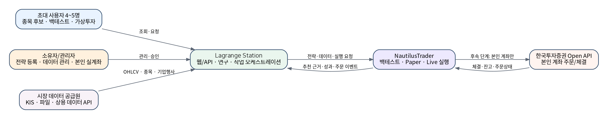
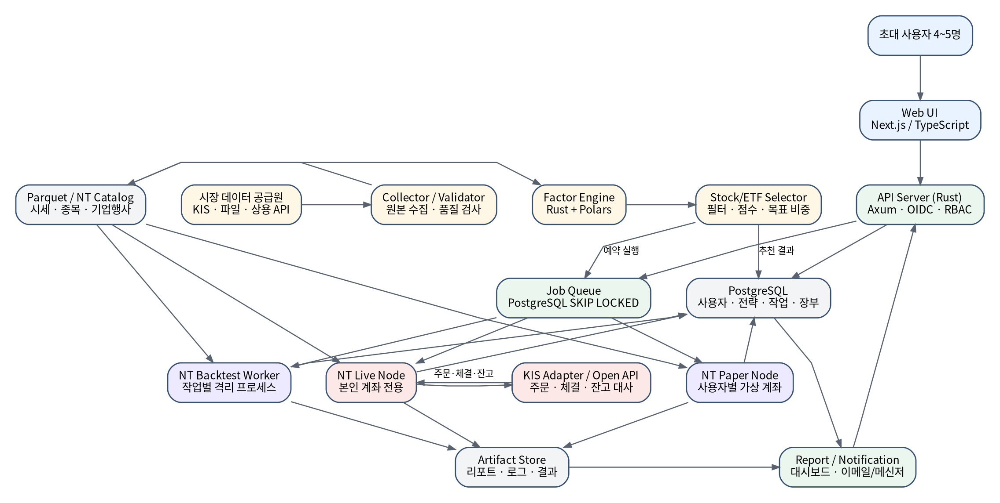
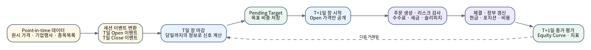
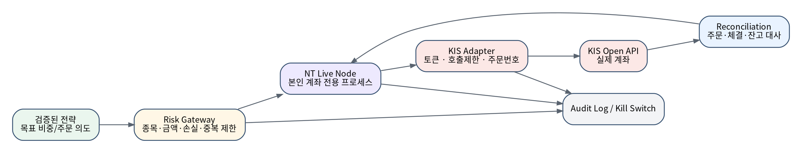

# 문서 정보

| 항목 | 내용 |
|---|---|
| 문서명 | Lagrange Station 시스템 설계서 |
| 프로젝트명 | Lagrange Station (내부 ID: `lagrange`, 저장소 루트: `lagrange-station`) |
| 버전 | 1.1 |
| 기준 요구사항 | Lagrange Station 요구사항서 v1.1 |
| 아키텍처 상태 | MVP 구현 기준선 |
| 주 엔진 | NautilusTrader |
| 배포 단위 | 단일 Linux 호스트, Docker Compose |

# 1. 설계 목표

Lagrange Station의 시스템 설계는 다음 상충 조건의 균형을 맞춘다.

- 4~5명이 안정적으로 사용할 수 있어야 하지만 대규모 SaaS 수준의 분산 구조는 피한다.
- Rust 중심의 소유 가능한 코드베이스를 유지하되, NautilusTrader의 안정된 공식 사용 경로를 활용한다.
- 종목 선정, 포트폴리오 구성, 백테스트, Paper, Live를 연결하되 각 책임을 분리한다.
- 일봉 전략에서 미래 데이터 참조를 방지하고, 실행 결과를 재현 가능하게 만든다.
- LEAN을 당장 운영하지 않지만, 나중에 독립 실행 엔진으로 붙일 수 있게 경계를 정의한다.
- 실거래 기능은 연구·가상투자보다 훨씬 엄격한 안전 경계를 적용한다.

# 2. 아키텍처 결정 기록

## ADR-001 — NautilusTrader를 주 엔진으로 사용

**결정:** 백테스트, Paper, 향후 Live 실행 엔진은 NautilusTrader를 사용한다.

**이유:**

- 백테스트와 라이브에서 동일한 전략·이벤트·실행 개념을 재사용할 수 있다.
- Rust 네이티브 코어와 Python/PyO3 또는 순수 Rust 경로를 제공한다.
- 주문·체결·포지션·계좌·대사 구조가 실거래 확장에 적합하다.
- C#/.NET 런타임을 필수로 포함하지 않는다.

**제약:** 순수 Rust API는 활발히 변경될 수 있으므로 MVP는 공식 고수준 API와 버전 고정을 우선한다.

## ADR-002 — 종목 선정은 엔진 외부에서 수행

**결정:** `Research & Selection` 계층이 후보군, 팩터, 점수, 목표 비중을 생성하고 NT는 이를 검증·실행한다.

**이유:**

- NautilusTrader가 종목 추천을 “자동 제공”하는 것이 아니며, 전략 규칙은 어차피 직접 정의해야 한다.
- 팩터 계산은 Polars 기반 배치 처리에 적합하고, 주문 이벤트 루프에서 분리하는 편이 안전하다.
- 동일 선정 결과를 백테스트·Paper·리포트에서 재사용할 수 있다.

## ADR-003 — LEAN은 MVP에서 제외

**결정:** LEAN은 소스 병합이나 필수 서비스로 포함하지 않는다.

**추가 조건:** 다음 중 하나가 실제 요구가 되면 독립 워커로 평가한다.

- 미국 주식 수천 종목의 Fundamental Universe 연구
- 복잡한 옵션 행사·배정·멀티레그 연구
- 선물 연속계약·롤오버 연구
- 동일 전략의 독립 엔진 교차 검증 필요

## ADR-004 — 일봉을 Open/Close 이벤트로 분리

**결정:** T일 종가로 판단하고 T+1일 시가에 체결하는 전략을 위해 일봉 데이터를 다음 두 이벤트로 변환한다.

- `SessionOpenEvent`: 세션 시작 시각, `open` 가격만 포함
- `DailyBarClosedEvent`: 세션 종료 시각, OHLCV와 장 마감 상태 포함

**이유:** NautilusTrader의 Bar 이벤트는 봉이 완료된 시점에 도착하므로, 일반적인 일봉 하나만 흘리면 다음 봉 시가 체결을 자연스럽게 표현하기 어렵다. 이벤트 분리를 통해 T+1일 시가 시점에 고가·저가·종가가 노출되는 것을 막는다.

## ADR-005 — 작업별 엔진 프로세스 격리

**결정:** 백테스트 한 건을 별도 프로세스 또는 단기 컨테이너에서 실행한다. Live는 계좌별 독립 프로세스로 실행한다.

**이유:** 엔진 상태, 전략 상태, 포트폴리오, 메모리 누수와 장애를 격리한다. Live TradingNode는 프로세스 단위로 운영한다.

## ADR-006 — PostgreSQL을 초기 작업 큐로 사용

**결정:** 별도 Redis·Kafka 없이 PostgreSQL 작업 테이블과 `FOR UPDATE SKIP LOCKED`를 사용한다.

**이유:** 동시 작업 1~2개인 4~5명 규모에서 구성요소를 최소화한다. 작업량 증가 시 Redis, NATS 또는 전용 워크플로 엔진으로 교체한다.

## ADR-007 — 코어 포크 금지 원칙

**결정:** MVP에서는 NautilusTrader 코어를 직접 수정하지 않는다.

**확장 순서:** 전략 → 커스텀 데이터 → 어댑터 → 외부 실행 알고리즘 → 최소 패치 순으로 확장한다. 코어 패치는 별도 디렉터리, 변경 사유, 회귀 테스트, 업스트림 버전 기준을 필수로 한다.

# 3. 시스템 컨텍스트

{ width=95% }

시스템 경계 안에는 사용자 인터페이스, 제어 API, 연구·선정, 데이터 관리, NautilusTrader 실행 노드, 결과·장부 저장이 포함된다. 시장 데이터 공급원과 KIS Open API는 외부 시스템이다.

# 4. 논리 아키텍처

{ width=100% }

## 4.1 계층 구분

| 계층 | 책임 | 주요 기술 |
|---|---|---|
| Presentation | 로그인, 전략 설정, 추천·성과·작업 화면 | Next.js, TypeScript |
| Control Plane | 인증, 권한, API, 작업 오케스트레이션, 감사 | Rust, Axum, SQLx |
| Research & Selection | 데이터 정제, 팩터, 필터, 랭킹, 목표 비중 | Rust, Polars |
| Trading Runtime | 백테스트, Paper, Live, 주문·체결·포트폴리오 | NautilusTrader |
| Storage | 메타데이터·장부, 시계열·팩터, 결과물 | PostgreSQL, Parquet |
| Broker Integration | 인증, 시세, 주문, 체결, 계좌 대사 | KIS Adapter |

# 5. 기술 스택

| 영역 | 선택 | 비고 |
|---|---|---|
| Frontend | Next.js + TypeScript | 내부용 반응형 웹. 모바일 앱 별도 개발 없음 |
| API | Rust + Axum | 인증 검증, RBAC, REST API |
| DB 접근 | SQLx | 컴파일 시 SQL 검증과 명시적 트랜잭션 |
| Research | Rust + Polars | 일봉·팩터 배치 계산 |
| Engine | NautilusTrader | 고수준 BacktestNode 우선, 향후 Rust 경로 확대 |
| RDB | PostgreSQL | 메타데이터, 작업, 사용자별 장부, 감사 |
| 시계열 파일 | Parquet | Raw/Curated/Feature/NT Catalog |
| Queue | PostgreSQL | SKIP LOCKED 기반 worker claim |
| 배포 | Docker Compose | 단일 Linux 호스트 |
| Reverse Proxy | Caddy 또는 Nginx | TLS, 접근제어, 압축 |
| Logging | Rust tracing + 구조화 JSON | correlation ID 포함 |
| Metrics | Prometheus 형식 + Grafana 선택 | 초기에는 필수 지표만 |

## 5.1 NautilusTrader 사용 경로

MVP는 다음 구성을 권장한다.

- NT 코어: 공식 배포 버전 고정
- Backtest: `BacktestNode` + Parquet Data Catalog
- 전략: 공식적으로 안정된 Python/PyO3 사용자 계층 우선
- 연구·팩터·웹·작업 관리: Rust
- 성능 또는 안정성 요구가 생긴 모듈: 순수 Rust v2로 점진 이전

이 구성은 C#을 사용하지 않으면서도, 변경이 잦은 순수 Rust API에 플랫폼 전체가 직접 결합되는 위험을 줄인다.

# 6. 컴포넌트 설계

## 6.1 Web UI

### 주요 화면

1. 대시보드
   - 데이터 최신 상태
   - 오늘의 후보 종목과 목표 비중
   - 진행 중인 백테스트
   - 가상계좌 요약
2. 전략 목록·상세
   - 전략 설명, 버전, 상태
   - 허용 파라미터와 기본값
3. 추천 결과
   - 종목, 목표 비중, 팩터 점수, 선정 사유
   - 제외 종목과 제외 이유
4. 백테스트 생성·결과
   - 기간, 데이터, 비용, 벤치마크
   - Equity Curve, Drawdown, 월별 수익률, 거래
5. 전략 비교·견고성
   - 파라미터 민감도, 비용 스트레스, 구간별 결과
6. 가상계좌
   - 현금, 포지션, 주문, 체결, 일별 성과
7. 관리자
   - 데이터셋, 작업, 워커, 오류, 사용자, 감사 로그
8. 실거래 제어(Owner 전용, 후속)
   - 연결 상태, 대사 상태, 주문 제한, Kill Switch

### 프론트엔드 원칙

- 브라우저는 브로커 비밀값을 보유하지 않는다.
- 백테스트 계산을 브라우저에서 수행하지 않는다.
- 차트는 서버에서 반환한 공통 결과 모델만 사용한다.
- URL에 사용자 ID나 비밀 파라미터를 넣지 않는다.

## 6.2 API Server

### 책임

- OIDC 토큰 검증과 사용자 매핑
- 역할·소유권 기반 권한 검사
- 전략·파라미터 스키마 검증
- 추천·백테스트·가상계좌 API
- 작업 생성의 멱등성 보장
- 결과 파일의 권한 확인 후 다운로드
- 관리·감사 API

### 내부 모듈

```text
api-server/
├── auth/
├── users/
├── strategies/
├── recommendations/
├── backtests/
├── portfolios/
├── jobs/
├── datasets/
├── audit/
└── engine_clients/
```

## 6.3 Data Collector / Validator

### 수집 흐름

1. 공급원별 커넥터가 데이터를 가져온다.
2. 응답 원문 또는 원본 파일을 Raw 영역에 저장한다.
3. 수집 배치 ID와 해시를 PostgreSQL에 기록한다.
4. 스키마, 중복, 누락, OHLC 관계, 시간대, 거래량을 검사한다.
5. 정상 데이터만 Curated Parquet로 변환한다.
6. 데이터셋 상태를 `READY`, `WARNING`, `BLOCKED`로 설정한다.

### 품질 규칙 예시

- `low <= min(open, close, high)`
- `high >= max(open, close, low)`
- `open`, `high`, `low`, `close` > 0
- 거래일 중복 금지
- 거래소 캘린더 대비 누락 감지
- 분할·배당 후보 급변 탐지
- 통화와 가격 단위 일관성
- 최신 장 마감 이후 예상 시간 내 데이터 도착 여부

## 6.4 Instrument Master

내부 식별자는 공급원 티커와 분리한다.

```text
InstrumentId = {canonical_symbol}.{venue}
예: 005930.KRX, SPY.ARCA
```

### 매핑 테이블

- 내부 InstrumentId
- KIS 종목 코드
- 데이터 공급원 심벌
- 향후 LEAN Symbol 매핑
- Nautilus Instrument 정의

종목 코드 변경 시 새 InstrumentId를 무조건 만드는 대신, 기업 동일성·시장 규칙에 따라 매핑 이력을 관리한다.

## 6.5 Factor Engine

### 인터페이스

```rust
pub trait Factor {
    fn id(&self) -> FactorId;
    fn version(&self) -> FactorVersion;
    fn required_fields(&self) -> &[Field];
    fn compute(&self, ctx: &FactorContext) -> Result<FactorFrame, FactorError>;
}
```

### MVP 팩터

- 1·3·6·12개월 수익률
- 최근 12개월에서 최근 1개월 제외 모멘텀
- 50·100·200일 이동평균 대비 가격
- 20·60·120일 실현 변동성
- 20일 평균 거래대금
- 최근 고점 대비 낙폭

### 결측값 정책

- lookback이 부족한 종목은 해당 팩터 `NULL`
- 전략별 필수 팩터가 `NULL`이면 제외
- winsorization, z-score, percentile 규칙은 팩터 버전에 포함
- 횡단면 표준화 시 해당 날짜 후보군 스냅샷을 고정

## 6.6 Stock/ETF Selector

### 파이프라인

```text
UniverseBuilder
  → EligibilityFilter
  → FactorSnapshot
  → ScoreComposer
  → Ranker
  → PortfolioConstraints
  → TargetPortfolio
```

### 출력 모델

```json
{
  "as_of": "2026-08-31T16:00:00+09:00",
  "strategy_version": "dual-momentum@1.2.0",
  "universe_snapshot_id": "...",
  "targets": [
    {
      "instrument_id": "SPY.ARCA",
      "target_weight": 0.40,
      "rank": 1,
      "score": 0.87,
      "reasons": ["12M 모멘텀 1위", "200일선 상단"]
    }
  ],
  "cash_weight": 0.10
}
```

Selector는 주문을 직접 만들지 않는다. 목표 비중은 Backtest/Paper/Live 실행 계층에 전달된다.

## 6.7 Strategy Registry

### 전략 패키지 구조

```text
strategies/
├── buy_and_hold/
├── trend_following/
├── relative_momentum/
├── dual_momentum/
└── inverse_volatility/
```

각 전략은 다음을 가진다.

- 전략 ID와 SemVer
- 설명과 위험 특성
- 파라미터 JSON Schema
- 지원 시장·자산·주기
- 요구 팩터와 최소 lookback
- 목표 비중 생성기
- NT 실행 어댑터
- 골든 테스트 데이터와 예상 결과
- 상태: Draft / Validated / Paper / LiveCandidate / Retired

### 사용자 코드 정책

MVP에서 Member는 전략 코드를 제출하지 않는다. Owner가 코드 리뷰·테스트 후 전략 패키지를 배포한다. 향후 사용자 코드가 필요하면 컨테이너 샌드박스, CPU·메모리·시간 제한, 네트워크 차단, 파일시스템 격리를 별도 설계한다.

## 6.8 Job Scheduler

### 작업 테이블 핵심 필드

```text
job_id
job_type
owner_user_id
status
priority
idempotency_key
payload_json
attempt
max_attempts
available_at
locked_by
locked_at
started_at
finished_at
error_code
error_message
```

### 워커 Claim

```sql
SELECT job_id
FROM jobs
WHERE status = 'QUEUED'
  AND available_at <= now()
ORDER BY priority DESC, created_at
FOR UPDATE SKIP LOCKED
LIMIT 1;
```

Claim 후 같은 트랜잭션에서 `RUNNING`, `locked_by`, `locked_at`를 설정한다.

### 재시도 정책

- 입력 오류·데이터 차단: 재시도 없음
- 일시적 파일/DB 오류: 지수 백오프로 1회
- 워커 프로세스 비정상 종료: ORPHAN 감지 후 1회
- 엔진 결정론 위반·결과 검증 실패: 자동 재시도 없이 차단

## 6.9 NT Backtest Worker

### 실행 단위

```text
Backtest Job
  → 임시 실행 디렉터리 생성
  → 설정·전략·데이터 링크 배치
  → NT 프로세스 실행
  → 결과 JSON/Parquet 생성
  → 공통 결과 검증
  → PostgreSQL/Artifact 저장
  → 임시 리소스 정리
```

### 프로세스 격리

- 작업당 독립 프로세스
- CPU·메모리 제한
- 읽기 전용 데이터 마운트
- 결과 디렉터리만 쓰기 허용
- 외부 네트워크 기본 차단
- 시간 제한과 정상 종료 유예

### 실행 메타데이터

```json
{
  "engine": "nautilustrader",
  "engine_version": "pinned-version",
  "strategy_id": "dual-momentum",
  "strategy_version": "1.2.0",
  "dataset_version": "kr-etf-daily-20260804.1",
  "config_hash": "sha256:...",
  "code_commit": "...",
  "random_seed": 42,
  "timezone": "Asia/Seoul"
}
```

## 6.10 Result Normalizer

NT 원시 결과를 플랫폼 공통 모델로 변환한다.

```text
BacktestResult
├── summary
├── equity_curve[]
├── drawdown_curve[]
├── monthly_returns[]
├── orders[]
├── fills[]
├── positions[]
├── cash_ledger[]
├── fees[]
├── benchmark[]
├── metrics
├── warnings[]
└── provenance
```

Normalizer는 다음 무결성을 검사한다.

- 최종 현금 + 포지션 가치 = 최종 자산
- 체결 수량 합계와 포지션 변화 일치
- 비용 합계와 현금 장부 일치
- 날짜가 단조 증가
- NaN/Infinity 지표 차단
- 초기·최종 자산과 수익률 일치

## 6.11 Paper Node

### 설계 선택

MVP에서는 사용자마다 장기 프로세스를 무조건 띄우기보다, 저빈도 전략에 맞게 **스케줄 실행 + 영속 장부** 방식을 우선한다.

1. 장 마감 후 추천·목표 비중 계산
2. 사용자별 Paper 계좌에 Pending Target 저장
3. 다음 세션 Open 이벤트에서 주문·체결 처리
4. 장 마감 가격으로 평가
5. 주문·체결·장부를 PostgreSQL에 영속화

분봉·실시간 Paper가 필요해지면 사용자 또는 가상계좌별 NT Sandbox/TradingNode 프로세스로 전환한다.

## 6.12 KIS Adapter

### 초기 구조

MVP에는 포함하지 않고 Phase 3에서 다음 모듈로 추가한다.

```text
kis-adapter/
├── auth.rs
├── rate_limit.rs
├── rest_client.rs
├── websocket_client.rs
├── instrument_mapper.rs
├── order_mapper.rs
├── execution_reports.rs
├── account_snapshot.rs
├── reconciliation.rs
└── idempotency.rs
```

### 핵심 규칙

- 토큰 발급·갱신은 단일 책임 모듈에서 직렬화한다.
- API 호출 제한은 endpoint/TR별 token bucket으로 관리한다.
- 내부 주문 ID와 KIS 주문번호를 영속 매핑한다.
- 주문 제출 타임아웃을 주문 실패로 단정하지 않는다.
- 같은 idempotency key의 주문 의도는 한 번만 제출한다.
- 재연결 후 미체결·체결·잔고를 전체 조회해 대사한다.
- 응답 원문에서 민감정보를 제거한 감사 기록을 보관한다.

## 6.13 Risk Gateway

실거래 주문은 다음 검사를 순서대로 통과해야 한다.

1. 시스템 Kill Switch 비활성
2. 시장·세션 상태 정상
3. 데이터 신선도 기준 충족
4. 전략이 `LiveCandidate` 이상
5. 계좌 대사 상태 정상
6. 허용 종목 목록
7. 종목당 최대 비중
8. 주문당 최대 금액
9. 일일 누적 주문 금액
10. 일일 손실 한도
11. 현금·주문 가능 수량
12. 중복 주문·충돌 주문 검사

검사 결과는 허용·거부와 근거 코드로 감사 로그에 기록한다.

# 7. 데이터 아키텍처

## 7.1 파일 레이아웃

```text
data/
├── raw/
│   ├── provider={provider}/market={market}/date={yyyy-mm-dd}/
│   └── manifests/
├── curated/
│   ├── bars/market={market}/symbol={symbol}/year={yyyy}/
│   ├── instruments/
│   ├── calendars/
│   └── corporate_actions/
├── features/
│   ├── factor={factor}/version={version}/date={yyyy-mm-dd}/
│   └── recommendations/
├── nautilus_catalog/
│   ├── bars/
│   ├── custom_session_events/
│   └── instruments/
└── artifacts/
    ├── backtests/{run_id}/
    ├── paper/{account_id}/
    └── reports/{report_id}/
```

## 7.2 PostgreSQL 주요 테이블

### Identity

- `users`
- `roles`
- `user_roles`
- `invitations`

### Strategy

- `strategies`
- `strategy_versions`
- `strategy_parameter_schemas`
- `user_strategy_configs`
- `strategy_promotions`

### Market Data Metadata

- `instruments`
- `instrument_aliases`
- `trading_calendars`
- `data_batches`
- `dataset_versions`
- `data_quality_issues`
- `corporate_actions`

### Research

- `universe_snapshots`
- `factor_definitions`
- `factor_snapshot_manifests`
- `recommendation_runs`
- `recommendation_items`
- `target_portfolios`

### Backtest

- `jobs`
- `backtest_runs`
- `backtest_metrics`
- `backtest_warnings`
- `result_artifacts`

대용량 Equity Curve·주문·체결은 Parquet에 저장하고 DB에는 경로, 행수, 해시, 요약을 저장한다.

### Portfolio / Trading

- `accounts`
- `cash_ledger`
- `positions`
- `orders`
- `fills`
- `daily_equity`
- `broker_connections`
- `reconciliation_runs`
- `risk_events`

### Operations

- `audit_logs`
- `worker_heartbeats`
- `notifications`
- `system_flags`

## 7.3 멀티테넌시

- 사용자 소유 테이블은 `owner_user_id` 또는 `account_id`를 필수로 가진다.
- Repository 계층에서 사용자 필터를 자동 적용한다.
- 가능하면 PostgreSQL Row Level Security를 방어층으로 추가한다.
- 공통 데이터셋과 팩터 스냅샷은 사용자 소유가 아니며 읽기 전용으로 공유한다.
- 결과 Artifact 접근은 DB 권한 확인 후 짧은 수명의 다운로드 URL 또는 API 스트리밍으로 제공한다.

# 8. 추천 파이프라인 상세

## 8.1 일일·월말 배치

```text
[장 마감 확인]
  → 가격 데이터 수집
  → 데이터 품질 검사
  → Curated 데이터셋 생성
  → 팩터 계산
  → 전략별 후보군·점수·목표 비중 생성
  → 추천 결과 저장
  → 사용자 구독별 알림
```

## 8.2 예시: 듀얼 모멘텀 ETF 전략

### 입력

- 위험자산: SPY, QQQ, EFA, EEM
- 방어자산: IEF 또는 현금성 ETF
- 평가주기: 매월 마지막 거래일
- lookback: 12개월
- 절대 모멘텀 기준: 0%

### 계산

1. 각 위험자산의 12개월 수익률을 계산한다.
2. 상대 모멘텀 1위 자산을 찾는다.
3. 1위 자산 수익률이 0%보다 높으면 해당 자산을 선택한다.
4. 그렇지 않으면 방어자산을 선택한다.
5. 다음 거래일 시가에 목표 비중으로 리밸런싱한다.

### 추천 설명

```text
SPY 선택
- 12개월 수익률: 18.2%
- 위험자산 중 순위: 1/4
- 절대 모멘텀 기준 0% 통과
- 목표 비중: 100%
```

## 8.3 포트폴리오 비중 계산

목표 금액:

```text
TargetValue_i = TotalEquity × TargetWeight_i
```

예상 주문 금액:

```text
OrderValue_i = TargetValue_i - CurrentMarketValue_i
```

정수 수량과 비용을 반영한 뒤 매도 주문을 먼저 계산하고, 실제 사용 가능한 현금으로 매수 수량을 재계산한다. 작은 비중 차이는 `rebalance_threshold` 미만이면 거래하지 않는다.

# 9. 백테스트 설계

## 9.1 이벤트 흐름

{ width=100% }

## 9.2 Open/Close 커스텀 데이터

### SessionOpenEvent

```text
instrument_id
trading_date
session_open_ts
open_price
currency
data_version
```

### DailyBarClosedEvent

```text
instrument_id
trading_date
session_close_ts
open
high
low
close
volume
adjustment_factor
```

### 처리 순서

- `DailyBarClosedEvent(T)`에서 지표와 추천을 계산한다.
- `PendingTarget(effective_date=T+1)`을 저장한다.
- `SessionOpenEvent(T+1)`에서 주문을 만든다.
- 체결 후 장부를 갱신한다.
- `DailyBarClosedEvent(T+1)`에서 포트폴리오를 평가한다.

이 설계는 시가 시점에 당일 고가·저가·종가를 참조하는 오류를 구조적으로 방지한다.

## 9.3 기업행사 처리

### 권장 모델

- 신호 계산: 수정/총수익 기준 시계열 사용 가능
- 주문 체결: 원시 가격 사용
- 분할: ex-date에 보유 수량과 평균단가 조정
- 현금 배당: pay-date 또는 명시된 정책에 따라 cash ledger 반영
- 상장폐지: 마지막 거래·청산 정책과 데이터 품질 경고

MVP ETF 데이터에서 기업행사 원천이 불완전하면 전략별로 “가격수익률 기준” 또는 “총수익률 기준”을 명시하고 비교 결과에 표시한다.

## 9.4 비용 모델 인터페이스

```rust
pub trait CostModel {
    fn estimate(&self, side: Side, quantity: Quantity, price: Price) -> CostBreakdown;
}

pub struct CostBreakdown {
    pub commission: Money,
    pub tax: Money,
    pub slippage: Money,
    pub total: Money,
}
```

시장별 프로필 예시:

- `KRX_EQUITY_DEFAULT`
- `KRX_ETF_DEFAULT`
- `US_EQUITY_DEFAULT`
- `CUSTOM`

세율과 수수료는 변경 가능하므로 코드 상수로 고정하지 않고 설정 버전으로 관리한다.

## 9.5 견고성 실행

기준 실행을 부모로 두고 파생 실행을 생성한다.

```text
RobustnessSuite
├── ParameterNeighborhood
├── CostStress
├── PeriodSplit
├── WalkForward
├── ExecutionDelay
└── BenchmarkComparison
```

모든 파생 실행은 부모의 전략·데이터 버전을 고정하고 하나의 변수만 변경한다.

## 9.6 전략 안정성 점수

초기 점수는 참고 지표이며 절대적 승인 기준으로 사용하지 않는다.

예시 구성:

- 검증 구간 초과수익 지속성: 25점
- 파라미터 주변값 안정성: 20점
- 비용 스트레스 생존: 15점
- MDD와 변동성: 15점
- 수익 집중도: 10점
- 최근 구간 성과: 10점
- 거래 가능성·회전율: 5점

점수와 함께 원시 근거를 반드시 표시한다.

# 10. Paper Trading 설계

## 10.1 계좌 모델

```text
PaperAccount
├── base_currency
├── initial_cash
├── current_cash
├── positions
├── open_orders
├── strategy_binding
├── cost_profile
└── status
```

## 10.2 처리 규칙

- 전략별 가상계좌를 기본으로 한다.
- 사용자 한 명이 여러 전략을 비교하려면 계좌를 분리한다.
- 같은 가상계좌에 여러 전략을 결합하는 기능은 후속으로 미룬다.
- 추천 결과의 목표 비중이 바뀌어도 사용자가 자동 실행 여부를 설정할 수 있다.
- Paper와 백테스트의 체결 모델 차이를 리포트에 표시한다.

# 11. Live Trading 설계

## 11.1 실행 구조

{ width=100% }

## 11.2 계좌별 프로세스

```text
owner-live-node-1
├── TraderId
├── KIS credentials reference
├── Strategy instances
├── Cache backing store
├── Order/Position state
└── Health / reconciliation state
```

한 프로세스에서 여러 Live TradingNode를 실행하지 않는다. 추가 계좌가 생기면 별도 프로세스·컨테이너를 생성한다.

## 11.3 주문 상태 머신

```text
INTENT_CREATED
  → RISK_APPROVED
  → SUBMITTING
  → SUBMITTED
  → ACCEPTED / REJECTED / UNKNOWN
  → PARTIALLY_FILLED
  → FILLED / CANCELED / EXPIRED
```

`UNKNOWN`은 네트워크 타임아웃 등으로 제출 결과를 모르는 상태다. 이 상태에서는 동일 주문을 즉시 재제출하지 않고 KIS 주문·체결 조회로 해소한다.

## 11.4 Reconciliation

### 시작 시

1. 캐시된 계좌·주문·포지션 로드
2. KIS 잔고·미체결·당일 체결 조회
3. 내부 주문 ID와 브로커 주문번호 매핑
4. 차이 계산
5. 자동 해소 가능한 차이 반영
6. 해소 불가능한 차이 발생 시 Live 시작 차단

### 실행 중

- 주기적 잔고 스냅샷
- 장기 미응답 주문 상태 조회
- WebSocket 누락 의심 시 REST 보정
- 내부 포지션과 브로커 포지션 불일치 경고·차단

# 12. API 설계

## 12.1 공통 규칙

- Prefix: `/api/v1`
- JSON 요청·응답
- ISO 8601 타임스탬프와 명시적 timezone
- 페이지네이션: cursor 방식
- 변경 API는 idempotency key 지원
- 오류 응답에 `code`, `message`, `correlation_id`, `details` 포함

## 12.2 주요 Endpoint

### 전략

```text
GET    /strategies
GET    /strategies/{strategyId}
POST   /strategies/{strategyId}/configs
GET    /strategy-configs/{configId}
```

### 추천

```text
POST   /recommendations/runs
GET    /recommendations/runs/{runId}
GET    /recommendations/latest?strategyConfigId=...
```

### 백테스트

```text
POST   /backtests
GET    /backtests/{runId}
POST   /backtests/{runId}/cancel
GET    /backtests/{runId}/metrics
GET    /backtests/{runId}/equity
GET    /backtests/{runId}/trades
POST   /backtests/{runId}/robustness
POST   /backtests/compare
```

### Paper

```text
POST   /paper/accounts
GET    /paper/accounts/{accountId}
POST   /paper/accounts/{accountId}/bind-strategy
GET    /paper/accounts/{accountId}/orders
GET    /paper/accounts/{accountId}/positions
GET    /paper/accounts/{accountId}/equity
```

### Admin

```text
GET    /admin/datasets
POST   /admin/datasets/{id}/approve
POST   /admin/datasets/{id}/block
GET    /admin/jobs
POST   /admin/jobs/{id}/retry
GET    /admin/workers
GET    /admin/audit-logs
```

### Live, 후속

```text
POST   /admin/live/connections
POST   /admin/live/nodes/{id}/start
POST   /admin/live/nodes/{id}/stop
POST   /admin/live/kill-switch/enable
POST   /admin/live/kill-switch/disable
GET    /admin/live/reconciliation
```

## 12.3 BacktestRequest

```json
{
  "strategy_config_id": "uuid",
  "dataset_version_id": "uuid",
  "start_date": "2015-01-01",
  "end_date": "2025-12-31",
  "initial_cash": {"currency": "USD", "amount": "100000"},
  "benchmark": "SPY.ARCA",
  "cost_profile_id": "us-equity-default@2026-01",
  "execution_profile": "daily-close-next-open@1",
  "robustness": false
}
```

## 12.4 오류 코드 예시

| 코드 | 의미 |
|---|---|
| DATASET_BLOCKED | 데이터 품질 차단 |
| DATA_STALE | 최신 데이터 기준 초과 |
| INVALID_STRATEGY_PARAMETER | 전략 파라미터 스키마 오류 |
| UNSUPPORTED_MARKET_CURRENCY | 시장·통화 조합 미지원 |
| BACKTEST_CAPACITY_EXCEEDED | 대기열 제한 초과 |
| RESULT_INTEGRITY_FAILED | 결과 무결성 검사 실패 |
| LIVE_RECONCILIATION_REQUIRED | 실계좌 대사 필요 |
| RISK_LIMIT_EXCEEDED | 주문 리스크 제한 위반 |
| ORDER_STATE_UNKNOWN | 주문 제출 결과 미확정 |

# 13. 배포 설계

## 13.1 Docker Compose 서비스

```text
reverse-proxy
web
api-server
postgres
research-worker
nt-backtest-worker-1
nt-backtest-worker-2
paper-scheduler
report-worker
metrics(optional)
live-node-owner(optional, Phase 3)
```

## 13.2 권장 호스트

초기 권장 기준:

- Linux x86_64
- 8 CPU 코어 권장
- RAM 16GB 최소, 32GB 권장
- NVMe SSD 1TB 권장
- 정기 백업용 별도 디스크 또는 원격 스토리지

ETF 일봉 중심이라면 더 낮은 사양에서도 가능하지만, 한국·미국 전체 종목과 장기간 팩터 스냅샷을 보관하면 메모리보다 디스크 용량·I/O가 먼저 중요해질 수 있다.

## 13.3 네트워크

- 외부 공개 포트는 reverse proxy의 443만 허용
- PostgreSQL과 워커 포트는 내부 네트워크 전용
- Backtest Worker는 기본적으로 인터넷 차단
- Data Collector와 KIS Adapter만 필요한 외부 도메인에 접근
- 관리자 화면은 VPN 또는 추가 접근제어를 권장

## 13.4 백업

- PostgreSQL: 매일 논리 백업 + WAL/PITR 선택
- Raw/Curated/Artifact: 증분 파일 백업
- 전략 패키지·설정: Git 저장소 + 릴리스 태그
- Secret: 별도 안전한 복구 절차. 일반 백업 파일에 평문 포함 금지
- 분기별 복구 리허설 또는 주요 변경 전 복구 테스트

# 14. 보안 설계

## 14.1 인증·인가

- OIDC Provider에서 인증
- 이메일 또는 subject allowlist로 초대 여부 확인
- API에서 매 요청마다 role과 리소스 소유권 검사
- Owner 민감 작업은 최근 인증 시각 또는 추가 인증 요구

## 14.2 비밀 관리

- KIS app key, secret, 계좌 참조값은 Secret Store에 저장
- DB에는 secret reference와 암호화된 최소 정보만 저장
- 로그 필터에서 토큰, 계좌번호, Authorization 헤더 제거
- 개발·테스트·운영 자격증명 분리

## 14.3 데이터 보호

- 사용자별 결과 접근 통제
- 개인정보 최소 수집
- Artifact URL 직접 노출 금지
- 감사 로그 append-only 정책
- 백업 암호화

## 14.4 공급망

- Rust `Cargo.lock`, Python lock, Node lock 파일 고정
- 컨테이너 이미지를 digest로 고정
- 의존성 취약점 점검
- NautilusTrader 업그레이드는 별도 브랜치에서 골든 백테스트 후 반영

# 15. 관측성과 운영

## 15.1 로그 필드

```text
timestamp
level
service
instance_id
correlation_id
user_id
job_id
run_id
account_id
strategy_id
engine_version
event
message
error_code
```

## 15.2 핵심 지표

### API

- request_count
- error_count
- latency_p50/p95/p99
- active_sessions

### Jobs

- queue_depth
- queue_wait_seconds
- job_duration_seconds
- job_failures_total
- orphaned_jobs_total

### Data

- latest_trading_date
- missing_bars_total
- blocked_datasets_total
- factor_run_duration

### Trading

- orders_submitted_total
- orders_rejected_total
- unknown_order_states
- reconciliation_mismatches
- stale_data_blocks
- kill_switch_state

## 15.3 알림 등급

| 등급 | 예시 | 전달 |
|---|---|---|
| INFO | 추천 완료, 백테스트 완료 | 웹, 선택적 메일 |
| WARNING | 데이터 일부 누락, 작업 재시도, Paper 불일치 | 웹 + 관리자 알림 |
| CRITICAL | Live 대사 실패, 중복 주문 위험, Kill Switch, DB 장애 | 즉시 관리자 알림 |

# 16. 오류 처리와 Fail-closed 정책

| 상황 | 처리 |
|---|---|
| 데이터 최신성 기준 초과 | 추천과 주문 생성 차단 |
| 일부 후보 종목 데이터 누락 | 전략 정책에 따라 종목 제외 또는 전체 차단. 결과에 명시 |
| 백테스트 결과 무결성 실패 | 실행 실패 처리, 결과 미공개 |
| 워커 메모리 초과 | 프로세스 종료, 작업 실패, 자동 재시도 제한 |
| KIS 주문 응답 타임아웃 | `UNKNOWN` 상태, 주문 조회로 해소 전 재제출 금지 |
| WebSocket 단절 | REST 상태 조회, 재접속, 대사 완료 전 신규 주문 제한 |
| 내부·브로커 포지션 불일치 | Live 전략 일시정지, 관리자 승인 필요 |
| DB 쓰기 실패 | 신규 Live 주문 차단. 주문 상태를 복구 가능하게 원문 로그 유지 |

# 17. 테스트 전략

## 17.1 테스트 피라미드

### Unit

- 팩터 계산
- 점수·랭킹
- 비중 제약
- 수수료·세금·슬리피지
- 주문 수량·현금 계산
- 권한·소유권 검사

### Integration

- Parquet → NT Catalog 변환
- Open/Close 이벤트 순서
- Backtest Worker → Result Normalizer
- PostgreSQL 작업 Claim·재시도
- Paper 계좌 장부
- KIS 모의 클라이언트 응답 매핑

### Golden / Regression

- 작은 고정 데이터셋
- 기준 전략별 추천·거래·성과
- 엔진 버전 업그레이드 비교
- 데이터 정제 규칙 변경 비교

### E2E

- 로그인 → 추천 → 백테스트 → 리포트
- 전략 → Paper 계좌 → 주문·체결 → 평가
- Owner Live 시작 → 대사 → 주문 → 체결 → 재시작

### Failure Injection

- 워커 강제 종료
- DB 일시 장애
- 데이터 파일 손상
- KIS 429·500·타임아웃
- WebSocket 순단
- 중복 이벤트
- 순서가 뒤바뀐 체결 통보

## 17.2 정확성 테스트 사례

- T일 종가 신호가 T일 종가로 체결되지 않는지 검증
- T+1 시가 이벤트에서 T+1 high/low/close 접근 불가 검증
- 분할 전후 총 평가액 보존
- 배당 현금 반영
- 상장폐지 종목 포함 유니버스
- 휴장일 월말 처리
- 시간대·서머타임 처리
- 소수점 반올림과 정수 수량
- 매도 후 매수 순서와 비용 예약

# 18. 성능·확장 계획

## 18.1 초기 용량

- 사용자 5명
- 고정 ETF 30개
- 일봉 20년
- 동시 백테스트 2개
- 가상계좌 최대 사용자당 5개
- 추천 전략 10개 이하

## 18.2 확장 단계

### 데이터 증가

- Parquet partition pruning
- 팩터 스냅샷 캐시
- DuckDB 또는 Polars lazy scan 활용
- Artifact 보존 주기와 압축

### 작업 증가

- 워커 수평 확장
- Queue를 Redis/NATS로 교체
- Object Storage 도입
- 실행 노드 별도 호스트 분리

### 사용자 증가

- 사용자별 rate limit
- OIDC 그룹 기반 권한
- DB Read Replica
- Paper Node 샤딩

현재 4~5명 규모에서는 이러한 분산 구성을 선제적으로 도입하지 않는다.

# 19. LEAN 확장 설계

## 19.1 공통 엔진 인터페이스

```rust
pub trait BacktestEngineAdapter {
    fn engine_id(&self) -> &'static str;
    async fn submit(&self, request: BacktestRequest) -> Result<EngineRunId, EngineError>;
    async fn status(&self, run_id: &EngineRunId) -> Result<EngineRunStatus, EngineError>;
    async fn collect(&self, run_id: &EngineRunId) -> Result<BacktestResult, EngineError>;
}
```

초기 구현:

```text
BacktestEngineAdapter
└── NautilusAdapter
```

후속:

```text
BacktestEngineAdapter
├── NautilusAdapter
└── LeanAdapter
```

## 19.2 전략 이식 경계

저빈도 포트폴리오 전략은 공통 `TargetPortfolio`를 통해 비교할 수 있다.

```text
Research & Selector
      ↓
TargetPortfolio
      ├── NT Execution Strategy
      └── LEAN PortfolioTarget Adapter
```

틱·호가·시장조성 전략은 NT 전용으로 둔다. LEAN의 Universe·Options 기능을 사용하는 전략은 LEAN 전용 연구 전략으로 둔다. 모든 전략을 두 엔진에서 동일 소스로 실행하려 하지 않는다.

## 19.3 추가 결정 트리거

LEAN 워커 추가는 다음 질문에 “예”가 될 때만 진행한다.

1. NT 외부 Selector를 직접 만드는 비용이 실제 병목인가?
2. 미국 Fundamental 데이터와 LEAN Universe가 확보됐는가?
3. 옵션 행사·배정 또는 선물 롤오버 모델이 핵심인가?
4. 독립 엔진 교차검증이 운용 금액 대비 가치가 있는가?
5. C#/.NET 컨테이너와 두 번째 엔진 유지 비용을 감수할 수 있는가?

# 20. 저장소 구조

```text
lagrange-station/
├── apps/
│   ├── web/
│   └── api-server/
├── crates/
│   ├── domain/
│   ├── auth/
│   ├── market-data/
│   ├── factor-engine/
│   ├── selector/
│   ├── portfolio-model/
│   ├── job-queue/
│   ├── result-model/
│   ├── risk-gateway/
│   └── kis-client/                 # Phase 3
├── nt/
│   ├── strategies/
│   ├── custom-data/
│   ├── backtest-worker/
│   ├── paper-runner/
│   └── live-node/                  # Phase 3
├── data-pipelines/
│   ├── collectors/
│   ├── validators/
│   ├── normalizers/
│   └── nt-catalog-builder/
├── migrations/
├── configs/
├── tests/
│   ├── fixtures/
│   ├── golden/
│   ├── integration/
│   └── e2e/
├── deploy/
│   ├── compose/
│   ├── caddy/
│   └── backup/
├── docs/
│   ├── requirements.md
│   ├── architecture.md
│   ├── runbooks/
│   └── adr/
└── patches/                        # 원칙적으로 비어 있음
```

# 21. 구현 순서

## Step 1 — 데이터와 시간 정확성

- ETF 소형 데이터셋
- 거래일 캘린더
- Open/Close 이벤트 변환
- 데이터 품질 검사
- Point-in-time 테스트 fixture

## Step 2 — 전략·팩터·Selector

- 모멘텀·추세·변동성 팩터
- 고정 유니버스
- 목표 비중 모델
- 설명 가능한 추천 출력

## Step 3 — NT 백테스트

- BacktestNode Worker
- 비용 모델
- 결과 Normalizer
- 골든 테스트

## Step 4 — 웹·멀티유저

- OIDC 초대 로그인
- 전략 설정
- 추천·백테스트 화면
- 사용자별 권한·Artifact 접근

## Step 5 — 견고성·Paper

- 민감도·비용 스트레스
- 가상계좌·스케줄
- 알림·운영 대시보드

## Step 6 — Owner Live

- KIS Adapter
- Risk Gateway
- Reconciliation
- Kill Switch
- 소액·수동 승인 운영 후 자동화 범위 확대

# 22. 구현 완료 정의

Lagrange Station v1은 다음 상태를 만족할 때 완료로 본다.

1. 사용자 5명이 초대 로그인할 수 있다.
2. ETF 전략 추천에 팩터 근거와 목표 비중이 표시된다.
3. 백테스트가 T종가 → T+1시가 규칙을 자동 검증한다.
4. 동일 실행이 재현되고 버전·설정·데이터 출처가 기록된다.
5. 사용자별 Paper 계좌가 독립적으로 운영된다.
6. 데이터 오류와 워커 장애가 다른 사용자·서비스를 중단시키지 않는다.
7. 실거래 기능은 Member에게 노출되지 않고 Owner 전용 안전장치 뒤에 위치한다.
8. NautilusTrader 코어 변경 없이 전략·어댑터·데이터 계층으로 구현된다.
9. LEAN 없이 요구사항을 충족하며, 향후 엔진 어댑터 추가 경계가 유지된다.

# 참고자료

- [R1] NautilusTrader Architecture: https://nautilustrader.io/docs/latest/concepts/architecture/
- [R2] NautilusTrader Backtesting: https://nautilustrader.io/docs/latest/concepts/backtesting/
- [R3] NautilusTrader High-Level Backtest API: https://nautilustrader.io/docs/latest/getting_started/backtest_high_level/
- [R4] NautilusTrader Live Trading: https://nautilustrader.io/docs/latest/concepts/live/
- [R5] Configure a Live Trading Node: https://nautilustrader.io/docs/latest/how_to/configure_live_trading/
- [R6] NautilusTrader Data and Custom Data: https://nautilustrader.io/docs/latest/concepts/data/
- [R7] NautilusTrader Rust API: https://nautilustrader.io/docs/latest/concepts/rust/
- [R8] NautilusTrader Repository and LGPL-3.0 License: https://github.com/nautechsystems/nautilus_trader
- [R9] KIS Open API 제휴안내: https://apiportal.koreainvestment.com/provider
- [R10] LEAN Engine: https://www.quantconnect.com/docs/v2/lean-engine/getting-started
- [R11] LEAN Algorithm Framework: https://www.quantconnect.com/docs/v2/writing-algorithms/algorithm-framework/overview
